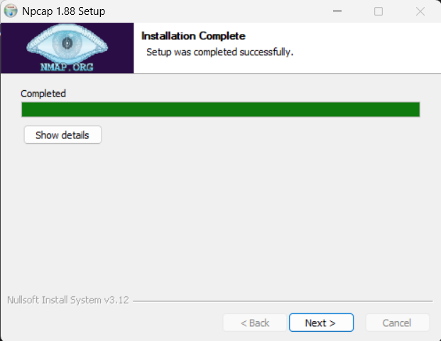
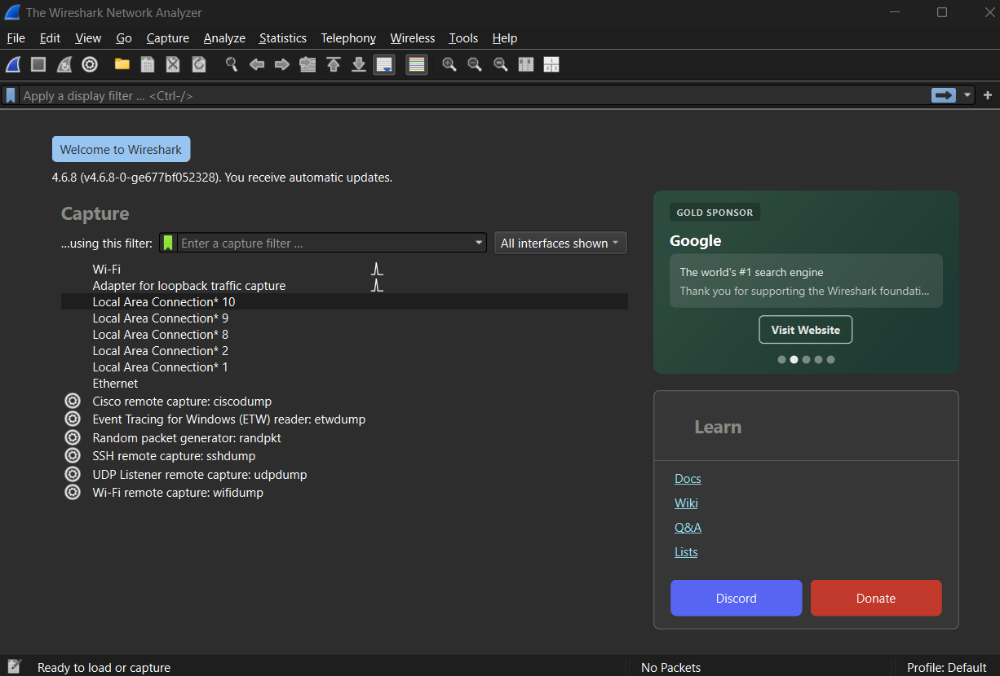
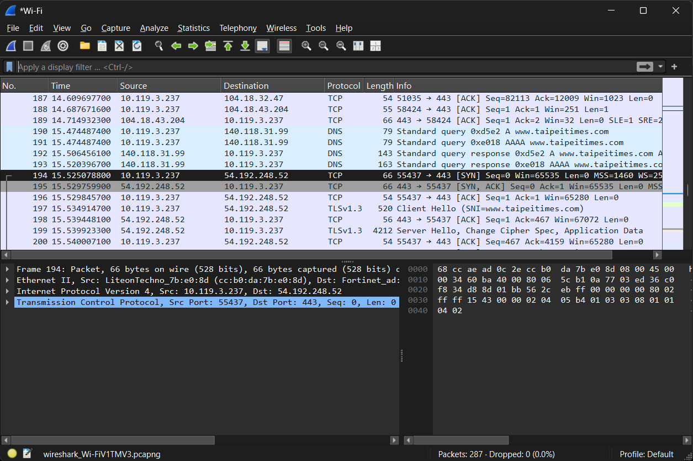
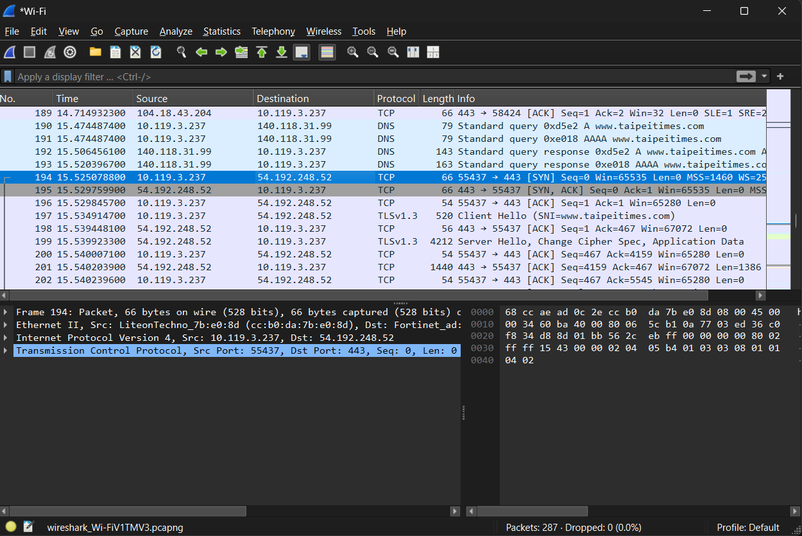
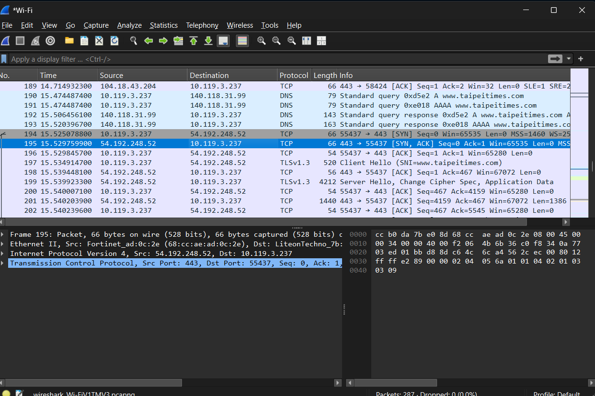
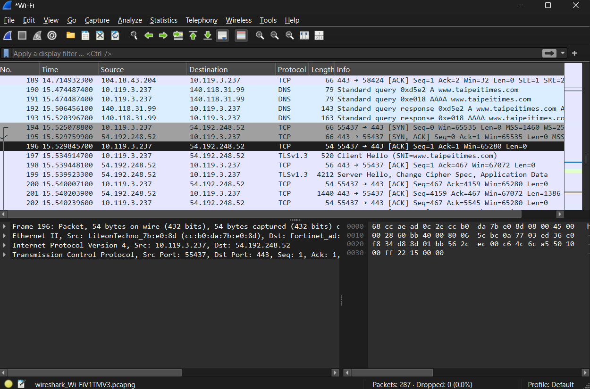
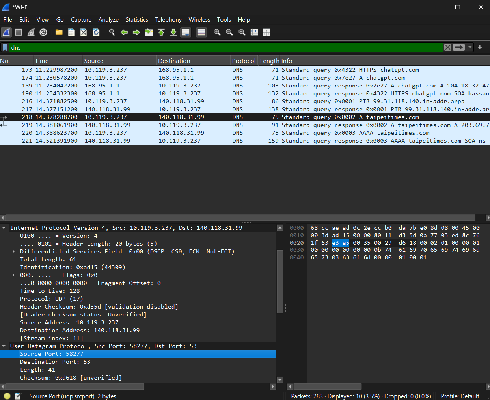

# Wireless Communications Lab0
###### tags: `Wireless Communications`

## :notebook_with_decorative_cover: Lab0 - Basic wireshark operation and capture

## 0. Install Wireshark and write a short installation guide. Include screenshots as evidence.

I downloaded Wireshark from the official Wireshark site (https://www.wireshark.org/download.html), I ran the installer, and I kept Npcap selected because Npcap is required for the live packet capture, which we will use in this lab. Here is a screenshot during the installation and after opening the application:

## 1. Website Packet Capture 

Which website did you access? www.taipeitimes.com

What are the IP address and port number of the website server?

- Server IP address: `203.69.75.164`
- Server port: `443` for HTTPS

What are the IP address and source port number of your PC when initially accessing the website?

- PC IP address: `10.119.3.237`
- Source port number: `55437`

What is the process of the TCP three-way handshake? Identify the SYN, SYN-ACK, and ACK packets. Briefly explain the purpose of each packet.

#### SYN

Packet number: `194`

`10.119.3.237:55437 → 54.192.248.52:443`

The client sends a SYN packet to request the establishment of a TCP
connection with the server.

#### SYN-ACK

Packet number: `195`

`54.192.248.52:443 → 10.119.3.237:55437`

The server sends a SYN-ACK packet to acknowledge the client's SYN and
indicate that it is ready to establish the connection.

#### ACK

Packet number: `196`

`10.119.3.237:55437 → 54.192.248.52:443`

The client sends an ACK packet to acknowledge the server's SYN-ACK.
After this packet, the TCP connection is established.

## 2. DNS Packet Analysis

### 2.1 What are the IP address and port number of the DNS server?

- DNS server IP address: `140.118.31.99`
- DNS server port number: `53`

### 2.2 What is the domain name in the DNS query?

taipeitimes.com

### 2.3 Which protocols does this DNS packet use?

Layer 2: Link Layer: Ethernet II
Layer 3: Network Layer: Internet Protocol Version 4 IPv4
Layer 4: Transport Layer: User Datagram Protocol UDP
Layer 5: Application Layer: Domain Name System DNS

