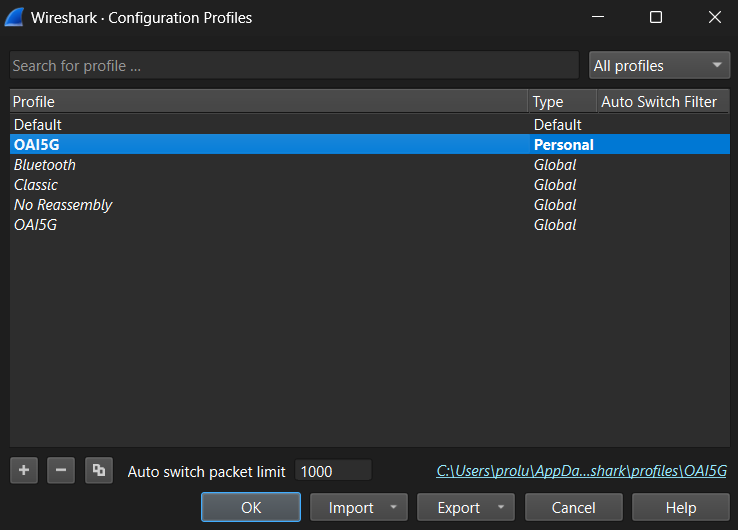
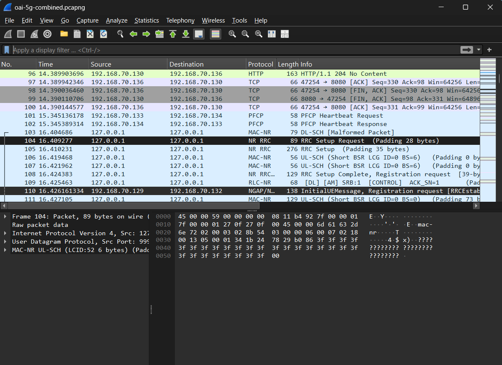
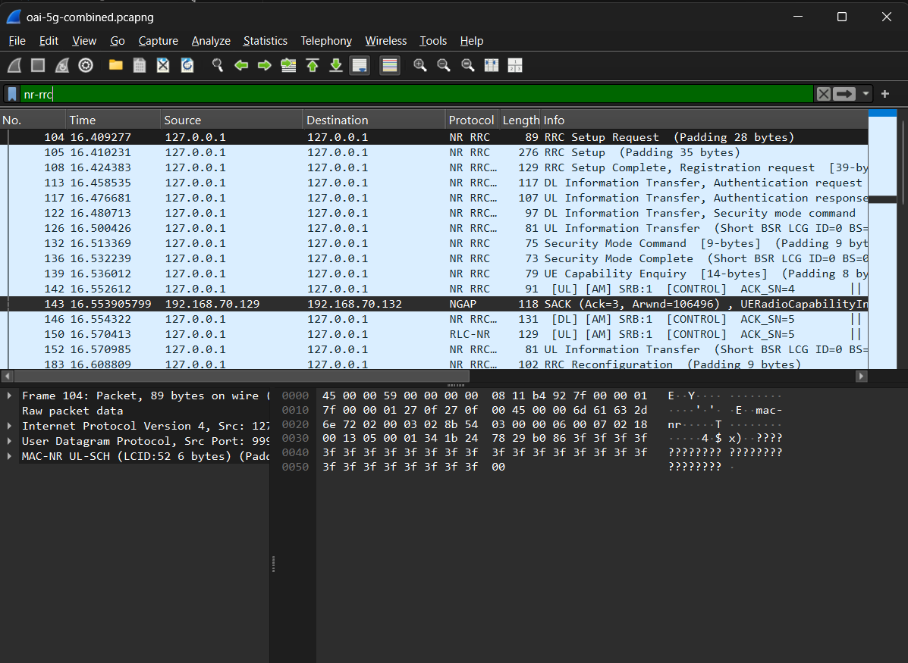
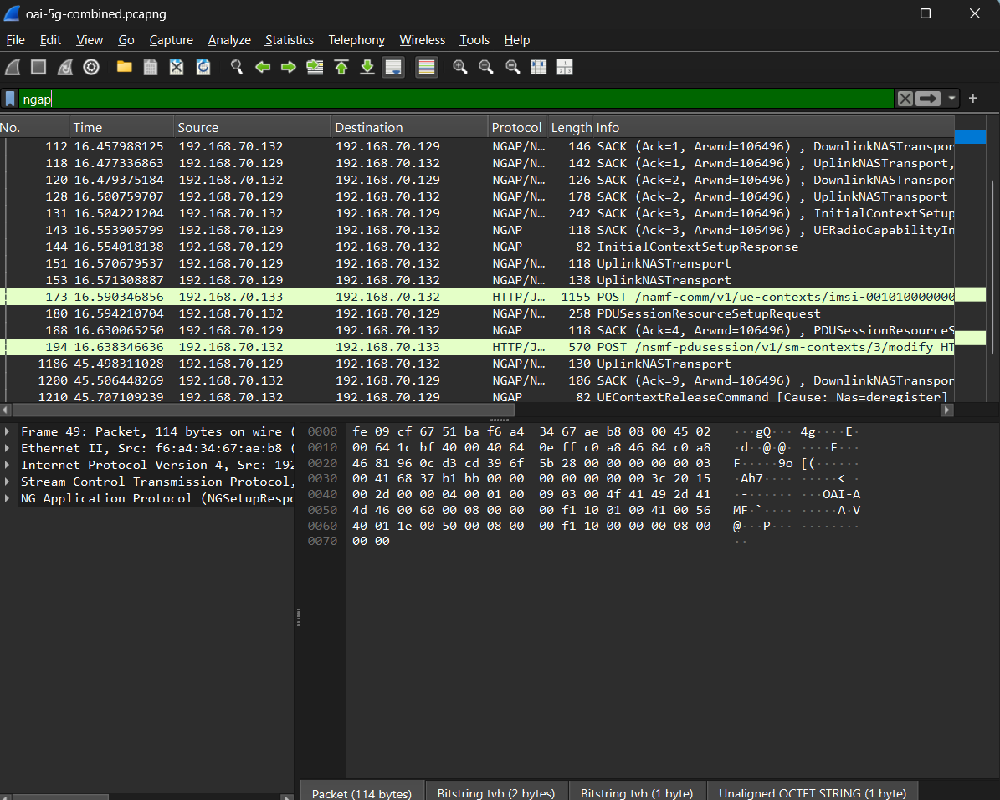
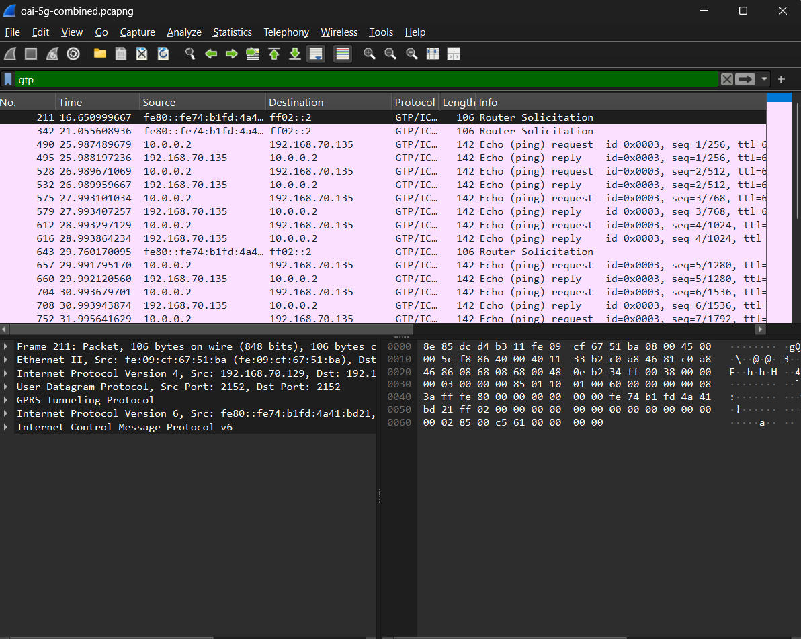
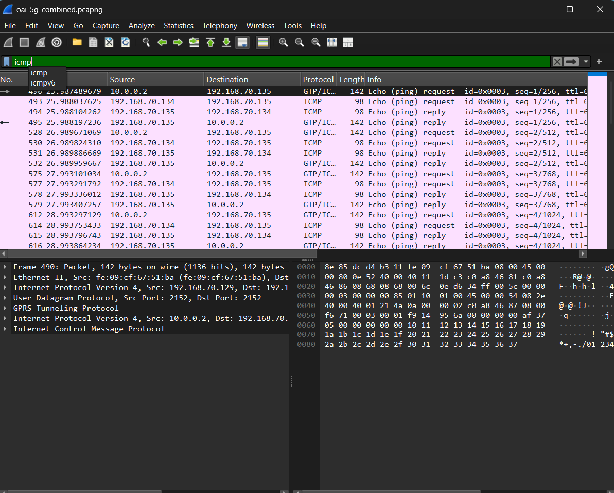
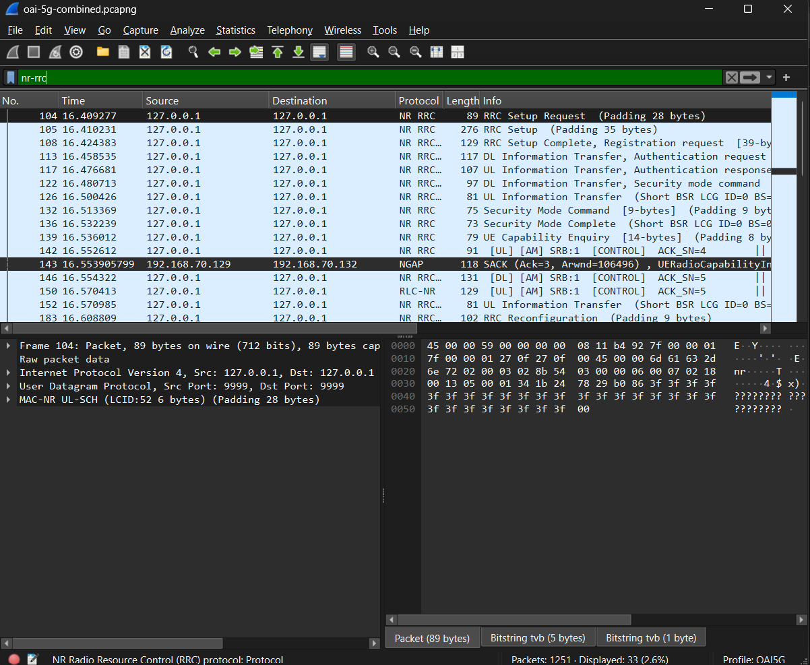
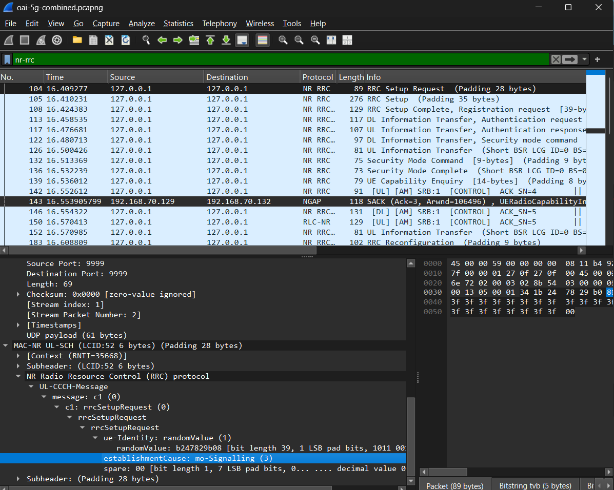

# Wireless Communications Lab0
###### tags: `Wireless Communications`

## :notebook_with_decorative_cover: Lab 1: Analyzing UE–gNB Connectivity in an OAI 5G SA Network(Student)

## 1. Lab Overview

After completing this lab, you should be able to:

Identify the UE, gNB, AMF, UPF, and Data Network.
Explain the purpose of RRCSetupRequest, RRCSetup, and RRCSetupComplete.
Explain how a NAS message is transported from the UE to the AMF through the gNB.
Identify the main 5G Registration messages.
Verify that the UE receives an IP address and exchanges user-plane traffic.

## 2. Required Files

OAI-5G-Wireshark-Profile.zip
oai-5g-combined.pcapng

## 3. Install the OAI-5G Wireshark Profile

## 4. Open and Verify the Capture

- The Protocol column shows NR RRC. And the Info column contains messages:
- RRC Setup Request
- RRC Setup
- RRC Setup Complete
- Security Mode Command
- RRC Reconfiguration

These are the 5G NR Radio Resource Control messages.

Checkpoint 1: Wireshark Setup

## 5. Identify the Basic 5G SA Architecture

Applied these filters individually: ngap, gtp, icmp

Checkpoint 2: Basic Architecture
Correctly identify the five components and their IP addresses.
Correctly explain N1, N2, and N3.

### Basic 5G SA Architecture

| Component | IP address | Evidence from the capture |
|---|---|---|
| UE PDU address | `10.0.0.2` | Source of the inside ICMP Echo Request in the Packet 490 |
| gNB | `192.168.70.129` | NGAP endpoint towards the AMF and outer GTP-U tunnel endpoint   |
| AMF | `192.168.70.132` | NGAP endgpoint communicates with the gNB|
| UPF | `192.168.70.134` | GTP-U tunnel engdpoint and forwards user plane traffics toward the data network|
| Data Network | `192.168.70.135` | Destinatiton of the ICMP Echo Requests from the UE|

### 5G Interfaces

| Interface | Connected components | Main protocol | Purpose |
|---|---|---|---|
| N1 | UE and AMF |NAS-5GS| Carries NAS signal logically between the UE and AMF. The signal goes through the gNB|
| N2 | gNB and AMF |NGAP| Carries controls plane signaling between the gNB and AMF. |
| N3 | gNB and UPF |GTP-U| Cariess user plane traffic between the gNB and UPF. |

## 6. Analyze the RRC Connection Establishment

## RRC Connection Establishment

| Message | Direction | Logical channel / SRB | Main purpose | Packet number |
|---|---|---|---|---|
| RRCSetupRequest | UE to gNB | UL-CCCH / SRB0 | The UE request establishsment of RRC conection with gNB. | `104` |
| RRCSetup | gNB to UE | DL-CCCH / SRB0 | The gNB takes the requesta and give RRC configuration that is needed to establissh the connection, with SRB1 config. | `105` |
| RRCSetupComplete | UE to gNB | UL-DCCH / SRB1 | The UE confirmed that RRC setup is compelete and takes the NAS registration request towards the 5G core. | `108` |

- What is the establishment cause in RRCSetupRequest? in packet 104: the establishment cause is `mo-Signalling`. This means the UE makes the RRC connection to send signaling traffic toward the network.
- What SRB does RRCSetupRequest use? Why? It uses `SRB0`. SRB0 is used for initial RRC signal because SRB1 is not initailized.
- Which side sends RRCSetup? `UE`. It is used to establish the RRC connection.
- Which signaling radio bearer is used after the RRC connection is established? to `SRB1`.
- Which NAS message is carried inside RRCSetupComplete? `Registration Request`.
- At the end of this procedure, is the UE only connected to the gNB, or is it already registered with the 5G Core? Explain. UE has establsished an RRC connection with gNB, but it is not with the 5G Core. The RRCSetupComplete message takes the NAS registration request. The gNB will take it to AMF and UE will complete tasks: security setup, registration accept and complete, authentication so the 5G registration is finished.

## 7. Connect RRC Signaling to NGAP and NAS

